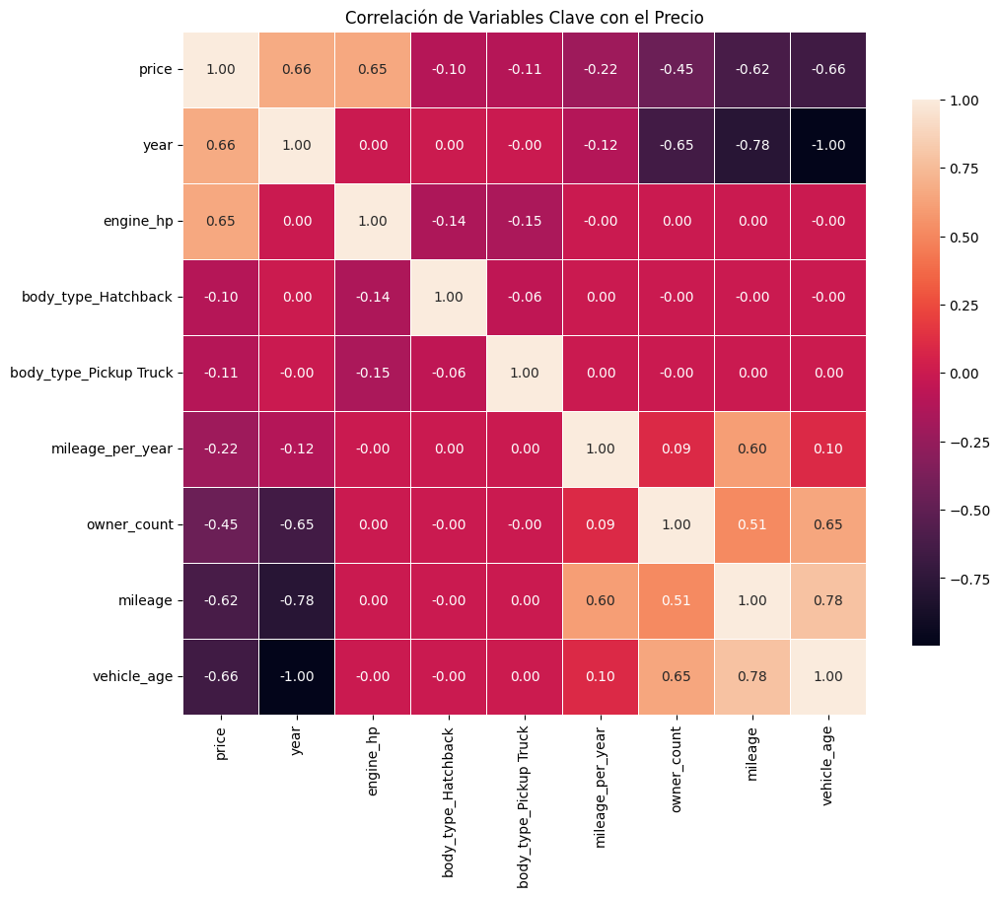
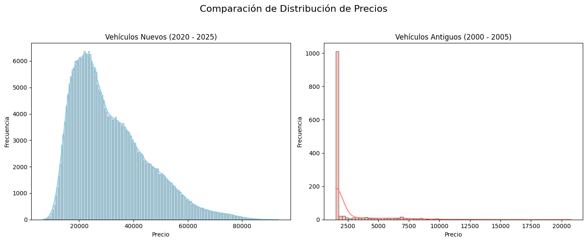
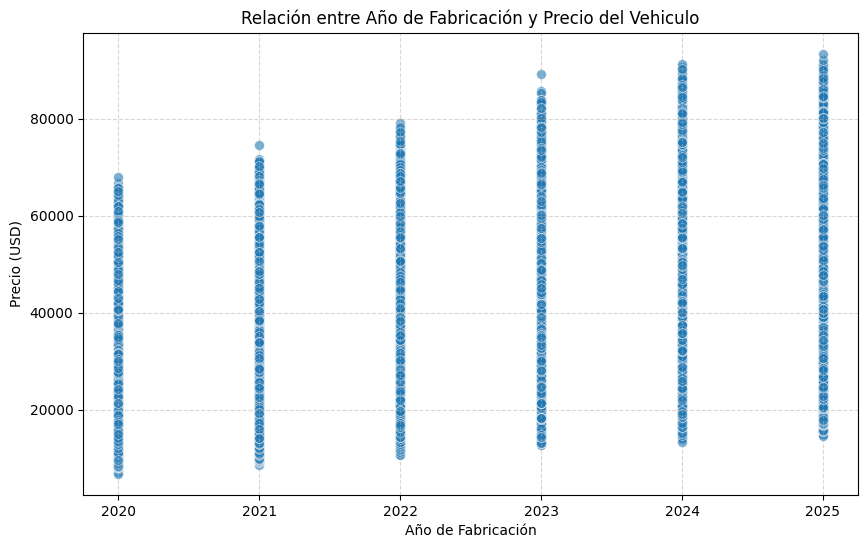
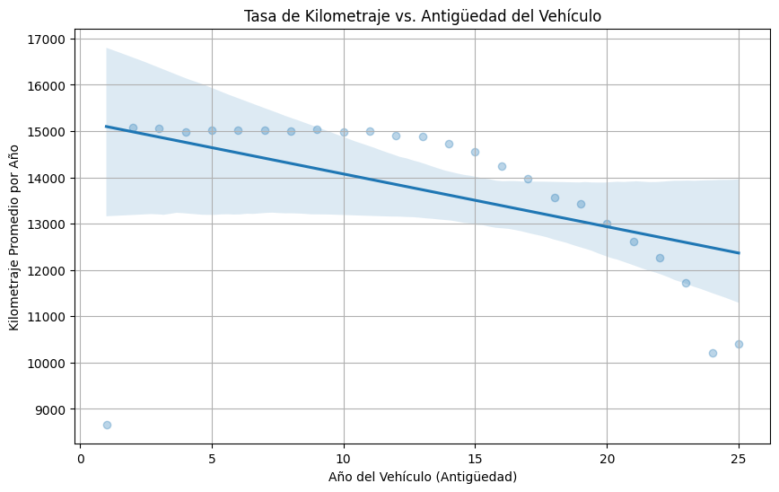
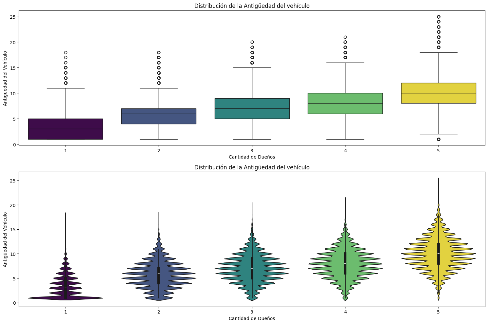
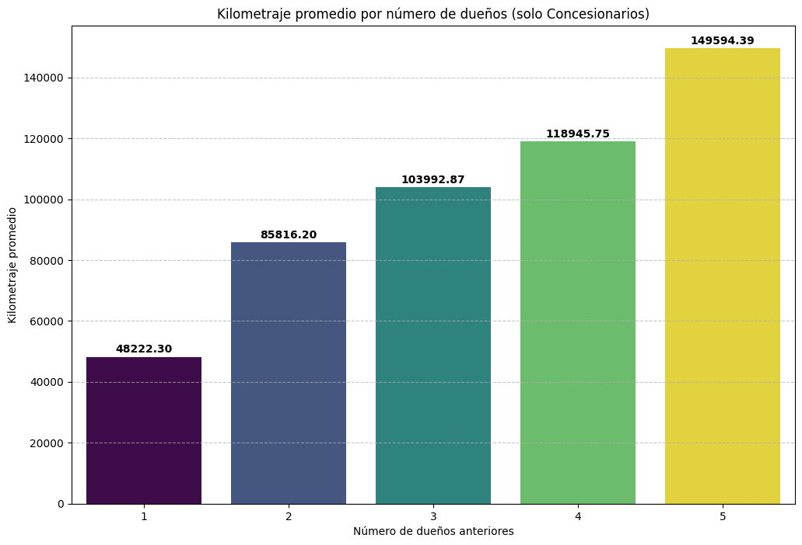
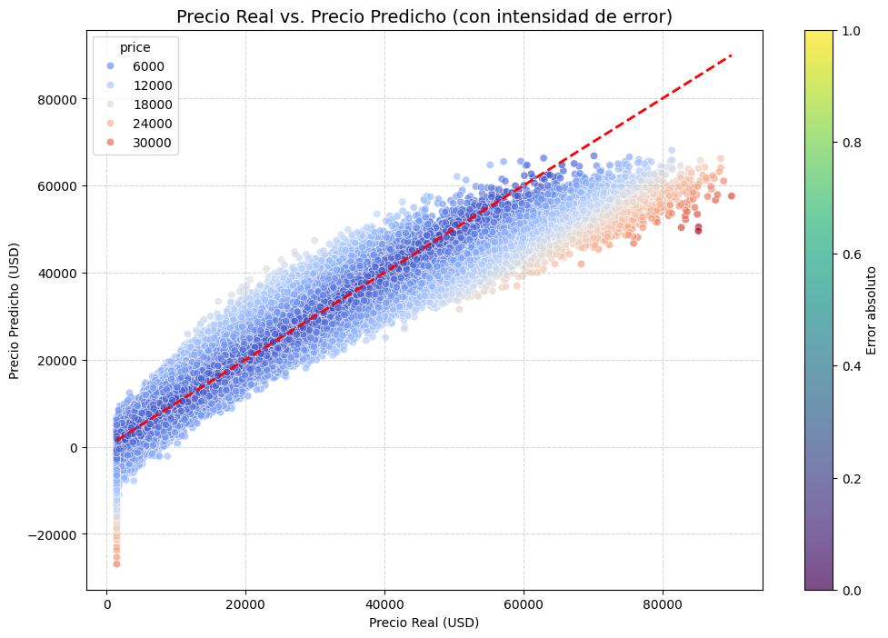
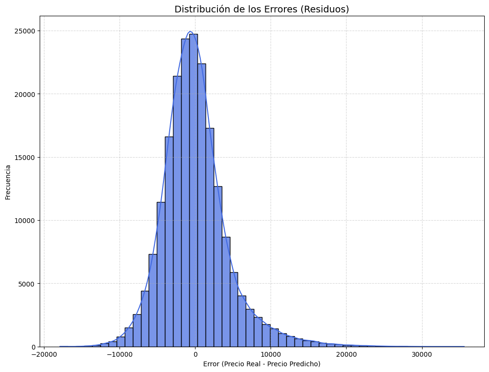

# 📊 Automotive Price
# Análisis del Precio de Autómiviles

En este proyecto se presetan un análisis exploratorio de datos y la implementación de algoritmos de aprendizaje automático al conjunto de datos [Automotive Price Prediction Dataset](https://www.kaggle.com/datasets/metawave/vehicle-price-prediction) de [Atul Kumar Choudhary](https://www.kaggle.com/metawave) con el fin de poner en practica las habilidades en el aprendizaje automático.


---

## 📚 Tabla de Contenidos

- [🎯 Propósito](#-propósito)
- [📦 Conjunto de Datos](#-conjunto-de-datos)
- [🧪 Desarrollo del Proyecto](#-desarrollo-del-proyecto)
- [💡 Insights Claves](#-insights-claves)
- [🛠️ Tecnologías](#️-tecnologías)
- [⚙️ Instalación](#️-instalación)
- [👤 Autor](#-autor)
- [📝 Licencia](#-licencia)

---

## 🎯 Propósito

El propósito de este proyecto es explorar cómo variables como marca, año, kilometraje y potencia afectan el valor de un vehículo. Esto como un caso de estudio educativo y profesional, integrando las etapas clave del ciclo de análisi de datos: recolección, limpieza, análisis, modelado y visualización.

---

## 📦 Conjunto de Datos

El conjunto de datos utilizado contiene las siguientes columnas:

- ``make:`` El fabricante o marca del vehículo (por ejemplo, Ford, Toyota).
- ``model:`` El modelo específico del vehículo (por ejemplo, F-150, Camry).
- ``year:`` El año en que se fabricó el vehículo.
- ``mileage:`` La distancia total que ha recorrido el vehículo, expresada en millas.
- ``engine_hp:`` La potencia del motor del vehículo, en caballos de fuerza (horsepower).
- ``transmission:`` El tipo de transmisión (Automática o Manual).
- ``fuel_type:`` El tipo de combustible que utiliza el vehículo (por ejemplo, Gasolina, Diésel, Eléctrico).
- ``drivetrain:`` El tipo de tracción del vehículo (por ejemplo, FWD - Tracción Delantera, RWD - Tracción Trasera, AWD - Tracción Total).
- ``body_type:`` El estilo de la carrocería del vehículo (por ejemplo, SUV, Sedán, Camioneta Pick-up).
- ``exterior_color:`` El color principal del exterior del vehículo.
- ``interior_color:`` El color principal del interior del vehículo.
- ``owner_count:`` El número de dueños anteriores que ha tenido el vehículo.
- ``accident_history:`` El historial de accidentes registrado del vehículo (Ninguno, Menor o Mayor).
- ``seller_type:`` El tipo de entidad que vende el vehículo (Concesionario o Particular).
- ``condition:`` La condición general del vehículo (Excelente, Buena o Regular).
- ``trim:`` El nivel de equipamiento específico del modelo del vehículo.
- ``vehicle_age:`` La antigüedad del vehículo en años, calculada como Año Actual - Year.
- ``mileage_per_year:`` El promedio de millas que el vehículo fue conducido por año.
- ``brand_popularity:`` Una puntuación que representa la popularidad de la marca según su frecuencia en el conjunto de datos.
- ``price:`` El precio de venta del vehículo usado en USD (Dólares Estadounidenses).
 
Fuente: [Automotive Price Prediction Dataset](https://www.kaggle.com/datasets/metawave/vehicle-price-prediction).

---

## 🧪 Desarrollo del Proyecto

### 1. **Carga y exploración inicial de los datos(Limpieza)**
Como primer paso para el desarrollo del proyecto se realizo la descarga del conjunto de datos por medio del siguiente script:
```Python
import pandas as pd
import kagglehub
import os

# Configuración ruta dentro del proyecto
path_personalizada = os.path.join(os.getcwd(), 'data/raw')

# Creación de la carpeta en caso de que no exista
os.makedirs(path_personalizada, exist_ok=True)

# Inidicar que carpeta usar como cache
os.environ['KAGGLEHUB_CACHE'] = path_personalizada

# Acceder al conjunto de datos de Kaggle
path = kagglehub.dataset_download('metawave/vehicle-price-prediction')
print('Conjunto de datos descargado en:', path)

# Revisar el conjunto de datos descargado
csv_path = os.path.join(path, 'vehicle_price_prediction.csv')
df = pd.read_csv(csv_path)
print(df)
```
Esto script nos permitio descargar el conjunto de datos Automotive Price Prediction Dataset desde kaggle.

Posteriormente se cargó el conjunto de datos en un Notebook para realizar una exploración y conocer/familiarizarse más sobre el conjunto de datos y detectar posibles problemas con el conjunto de datos.

El conjunto de datos cuenta con 1000000 registro(filas) y 20 columnas de las cuales cuentan con los siguientes tipo de datos:
```Bash
#   Column            Non-Null Count    Dtype  
---  ------            --------------    -----  
 0   make              1000000 non-null  object 
 1   model             1000000 non-null  object 
 2   year              1000000 non-null  int64  
 3   mileage           1000000 non-null  int64  
 4   engine_hp         1000000 non-null  int64  
 5   transmission      1000000 non-null  object 
 6   fuel_type         1000000 non-null  object 
 7   drivetrain        1000000 non-null  object 
 8   body_type         1000000 non-null  object 
 9   exterior_color    1000000 non-null  object 
 10  interior_color    1000000 non-null  object 
 11  owner_count       1000000 non-null  int64  
 12  accident_history  249867 non-null   object 
 13  seller_type       1000000 non-null  object 
 14  condition         1000000 non-null  object 
 15  trim              1000000 non-null  object 
 16  vehicle_age       1000000 non-null  int64  
 17  mileage_per_year  1000000 non-null  float64
 18  brand_popularity  1000000 non-null  float64
 19  price             1000000 non-null  float64
```
Como los tipos de datos de cada columna son correctos y no haya necesidad de realizar alguna transformación de datos adicional pasamos a explorar cada columna en busca de valores nulos/faltantes.

```Bash
Columnas del conjunto de datos con valores nulos
Columnas            Cant. Nulos
make                         0
model                        0
year                         0
mileage                      0
engine_hp                    0
transmission                 0
fuel_type                    0
drivetrain                   0
body_type                    0
exterior_color               0
interior_color               0
owner_count                  0
accident_history        750133
seller_type                  0
condition                    0
trim                         0
vehicle_age                  0
mileage_per_year             0
brand_popularity             0
price                        0
```
Se encontro que la columna `accident_history` es la unica columna con valores nulos. 

```Bash
Tipos de datos y cantidad de accident_history
Minor    199981
Major     49886

Cantidad de valores nulos encontrados
750133
```
Explorando más a detalle la columna `accident_history` se encontraron 2 categorias que son **Minor** con *199981* registros y **Mayor** con *49886* registros y *750133* registros con valores nulos, los valores nulos nos puede dar a entener que registros con dichos valores nulos son vehículos no tubieron accidentes por lo que se imputara los registros con valores nulos y se colocara `No Accident`.

```Bash
Cantidad de valores nulos después de imputar: 0
```
 Una vez que se han corregido los problemas con el conjunto de datos se guarda el conjuntos limpio en la siguiente dirección `../data/processed/vehicle_price.csv`.

### 2. **Análisis exploratorio de datos (EDA)**
Con el conjunto de datos limpio podemos empezar a realizar un análisis exploratorio más profundo que nos ayude a comprender el cómo variables como marca, año, kilometraje, potencia, etc.. pueden llegar afectan el valor de un vehículo, la relación entre el desgastes y los años del vehículo así como el patron de uso y su comportamiento en el mercado.

Para esto realizamos una correlación que nos ayudara a vizualizar las variables que más se correlacionan.


Las columnas correlacionadas con mayor relevancia son:
- Price y year: 0.66
- price y engine_hp: 0.65
- mileage_per_year y mileage: 0.60
- vehicle_age y mileage: 0.78
- vehicle_age y owner_count: 0.65
- ower_count y mileage: 0.51

En base a estas correlaciones responderemos a las siguientes preguntas.

#### **Precio Vs Año**
**¿Cuál es el precio promedio de los vehículos para cada año de fabricación presente en el conjunto de datos?**
La siguiente listas muestra como ha ido evolucionando el precio de los vehículos a lo largo de los años. 
```Bash
Año      Precio Promedio
2000        $2905.55   
2001        $1884.48   
2002        $2018.76   
2003        $1979.12   
2004        $2281.11   
2005        $2726.74   
2006        $3086.62   
2007        $3550.47   
2008        $4157.68   
2009        $4923.88   
2010        $5896.97   
2011        $6996.29   
2012        $8328.50   
2013        $9867.73   
2014        $11602.28  
2015        $13687.58  
2016        $15807.08  
2017        $18080.29  
2018        $20554.71  
2019        $23123.00  
2020        $25946.04  
2021        $28731.71  
2022        $31898.80  
2023        $35301.98  
2024        $39009.84  
2025        $39425.81  
```
Durante los años 2000 al 2013 la diferencia de precio promedio de los vehículos no era tan grande, pero a partir del 2014 hasta el 2025 la diferencia de precio incremento haciendo que cada año vaya en aumento el precio de los vehículos.

**¿Cómo se distribuyen los precios de los vehículos más nuevos (por ejemplo, últimos 5 años) en comparación con los más antiguos?**

En ambos gráficos se muestran que el precio de los vehículos sigue una distribución sesgada a la derecha (positiva). Esto significa que la mayoría de las transacciones ocurren en los precios más bajos, y una minoría de vehículos de lujo o especiales eleva el precio promedio, extendiendo la distribución hacia la derecha.

**¿Existe un punto a partir del cual el aumento en el año de fabricación (vehículo más nuevo) ya no se traduce en un incremento significativo en el precio?**

El punto de inflexión o saturación para el precio máximo del vehículo ocurre a partir del año de fabricación 2023. Esto significa que:
* Un modelo 2025 no tiene un techo de precio significativamente mayor que un modelo 2023.
* El valor marginal de ser un año más nuevo es cercano a cero para el segmento de vehículos de precio más alto (lujo o gama alta) a partir de 2023.

#### **Precio vs. Potencia del Motor**
**¿Cuál es el rango de potencia del motor más común para los vehículos con un precio superior al percentil 75?**
```Bash
Percentil 75: $27601.40
Potencia del motor de Vehículos con un Precio Superior al percentil 75 ($27601.40)
engine_hp(Maxima): 576 
engine_hp(Minima): 90
```
El rango de potencia del motor más común de vehículo con un precio superior al percentil 75 va de ``90`` a ``576`` hp.

**¿Cómo varía el precio promedio (price) de los vehículos al agruparlos en cuartiles (Q1, Q2, Q3, Q4) basados en la potencia de su motor (engine_hp)?**
```Bash
Percentiles Potencia de Motor
0.25    162.0
0.50    215.0
0.75    300.0
Name: engine_hp, dtype: float64

Precio Promedio de los Vehículos
Bajo(< 162):             $11407.64  
Bajo - Medio(162 < 215): $14809.71  
Medio - Alto(215 < 300): $22123.70  
Alto(> 300):             $33249.04
```
El factor "potencia del motor" no solo influye en el precio, sino que su impacto se acelera a medida que la potencia aumenta. El costo marginal de añadir caballos de fuerza es significativamente mayor en el segmento superior que en el segmento inferior.

**¿Qué tipo de carrocería (body_type) o marca (make) tiene la mayor correlación entre engine_hp y price?**
```Bash
El tipo de Marca con la correlación es: Kia
Valor de la correlación: 0.081982
```
La marca que tiene más correlación entre engine_hp y price es la marca de KIA, esto quiere decir que a medida que aumenta la potencia (engine_hp), también aumenta el precio (price).

#### **Antigüedad del Vehículo vs. Kilometraje**
**¿Cómo se comporta la tasa de kilometraje por año (mileage_per_year) en función de la antigüedad del vehículo? ¿Los vehículos más antiguos tienden a tener una mileage_per_year menor o mayor?**

La gráfica muestra una tendencia descendente de mileage_per_year conforme aumenta la antigüedad del vehículo.
Esto significa que:

* Vehículos más nuevos (baja vehicle_age) → tienen un kilometraje anual más alto.
* Vehículos más antiguos (alta vehicle_age) → tienen un kilometraje anual más bajo.

En otras palabras, los vehículos más antiguos tienden a ser usados menos cada año.

**Para cada categoría de condición (condition), ¿cuál es la mileage promedio de los vehículos con más de 10 años de antigüedad?**
```Bash
Condición   Promedio de kilometro
Good                    178991.92
Fair                    178716.14
Excellent               178491.63
```
Entre los vehículos con más de 10 años de antigüedad, el kilometraje promedio es similar entre las distintas condiciones ("Excellent", "Good", "Fair"). Esto sugiere que la condición del vehículo no depende únicamente del kilometraje acumulado, sino también del mantenimiento y el uso que ha recibido.

**¿Qué tipo de tracción (drivetrain) o tipo de combustible (fuel_type) muestra la mileage más alta para un vehículo con una antigüedad determinada?**
```Bash
Tipo de Tracción     Kilometraje Promedio
FWD                             150044.65
AWD                             149838.75
RWD                             149779.97
Tipo de Combustible  Kilometraje Promedio
Electric                        150099.06
Diesel                          149860.65
Gasoline                        149667.40
```
Para vehículos con 10 años de antigüedad, el tipo de tracción FWD presenta el mayor kilometraje promedio acumulado, seguido por AWD y RWD. En cuanto al tipo de combustible, los vehículos eléctricos muestran la mileage promedio más alta, seguidos por los vehículos diésel y gasolina.

#### **Antigüedad del Vehículo vs. Conteo de Dueños**
**¿Cuál es la antigüedad promedio de los vehículos que han tenido tres o más dueños?**
```Bash
La antiguedad promedio de vehiculos con 3 o más dueños es de: 9.01 años
```
Los vehículos que han pasado por 3 o más dueños tienen una antigüedad promedio de ≈ 9 años. Esto tiene sentido: mientras más años tenga un vehículo, más probable es que haya cambiado de propietario varias veces.

**¿Cómo se distribuye la antigüedad del vehículo en los vehículos con un owner_count de 1 (un solo dueño) en comparación con aquellos con un owner_count alto?**

Los vehículos con un solo dueño tienden a ser más nuevos y con menor variación en su antigüedad. Conforme aumenta el número de propietarios, la antigüedad promedio del vehículo incrementa y la distribución se vuelve más amplia. Esto sugiere que los vehículos con mayor cantidad de dueños tienden a haber sido utilizados por más tiempo y presentan historiales más variados.

#### **Kilometraje por Año vs. Kilometraje Total**
**¿Cuál es la mileage_per_year promedio de los vehículos clasificados en el 25% superior de mileage total?**
```Bash
Kilometraje total (percentil 75): 157865.00
Promedio de mileage_per_year del 25% superior: 19098.50
```
Los vehículos que se encuentran en el 25% superior de kilometraje total muestran una tasa de kilometraje anual mayor. Esto indica que fueron utilizados de manera más intensiva a lo largo de su vida útil, probablemente debido a desplazamientos frecuentes, viajes largos o uso continuo.

#### **Conteo de Dueños vs. Kilometraje Total**
**¿Cuál es el kilometraje promedio de los vehículos según el número de dueños anteriores?**

Cuantos más dueños ha tenido un vehículo, mayor es el kilometraje promedio acumulado.

**¿Cómo se diferencia el kilometraje de los vehículos vendidos por un Concesionario (seller_type) en función del número de dueños que han tenido?**

En los concesionarios, los vehículos con más dueños previos tienden a tener un kilometraje mucho más alto.
Esto sugiere que los autos que han pasado por más manos tienden a haber sido utilizados más intensamente o tener más años de servicio.

### 3. **Modelo de Regresión Lineal — Predicción de Precio de Vehículos Usados**
Se desarrolló un modelo de regresión supervisada utilizando la técnica de Regresión Lineal con el objetivo de predecir el precio de venta de vehículos usados a partir de variables como la antigüedad, kilometraje, tipo de combustible, potencia del motor, tipo de transmisión, número de dueños, entre otras características relevantes.

El modelo fue entrenado con un conjunto de datos dividido en 80% para entrenamiento y 20% para prueba, aplicando técnicas de preprocesamiento (codificación de variables categóricas y escalado de variables numéricas).

***Resultados de Desempeño***
```Bash
MAE: 3174.71
MSE: 18911377.31
R²: 0.899
```
El modelo presenta un buen nivel de ajuste, con un R² de 0.899, lo que indica que las variables incluidas explican gran parte de la variación en los precios.
El error medio (MAE ≈ 3,175 USD) es razonable considerando los rangos de precio del conjunto de datos, lo cual sugiere que el modelo tiene un desempeño sólido para una primera aproximación sin optimización avanzada.


El gráfico muestra una distribución coherente y un ajuste bastante sólido entre el precio real y el predicho:
* La tendencia ascendente bien alineada con la línea roja indica que el modelo captura correctamente la relación general entre las variables.
* Las zonas rojizas al final (valores altos) reflejan que el modelo tiende a subestimar ligeramente los precios más altos, lo cual es común en modelos de regresión lineal porque suavizan los extremos.
* La escala de color por error absoluto agrega una lectura intuitiva: cuanto más oscuro o cálido el punto, mayor el error de predicción.


Para analizar el desempeño del modelo de regresión lineal en la predicción del precio de los vehículos, se generó un histograma de los errores (residuos), definidos como la diferencia entre el precio real y el precio predicho.

La distribución de los errores muestra una forma aproximadamente normal centrada en cero, lo que indica que el modelo no presenta un sesgo sistemático al realizar las predicciones. Es decir, los errores positivos y negativos se distribuyen de manera equilibrada.

La mayoría de los residuos se encuentran en un rango de ±10,000 USD, reflejando que el modelo logra una buena precisión en la estimación de precios. No obstante, se observa una ligera asimetría hacia el lado derecho de la distribución, lo que sugiere que el modelo tiende a subestimar algunos vehículos con precios más elevados.

En conjunto, esta distribución de residuos, junto con las métricas de rendimiento (MAE: 3,174.71, MSE: 18,911,377.31, R²: 0.899), confirman que el modelo logra un ajuste sólido y generaliza correctamente dentro de los valores del conjunto de datos.

6. **Conclusiones y recomendaciones**:
   - Síntesis de hallazgos clave y propuestas de acción.

---

## 💡 Insights Claves

- [Insight 1]
- [Insight 2]
- [Recomendación práctica o estratégica basada en los datos]

---

## 🛠️ Tecnologías

- Python
- Pandas
- Matplotlib
- Seaborn
- Jupyter Notebook / Google Colab
- [Otras herramientas que uses, como Scikit-learn, Plotly, etc.]

---

## ⚙️ Instalación

### 1. Clonar este repositorio:
```bash
git clone https://github.com/tu_usuario/nombre_del_proyecto.git
```
### 2. Uso de un Entorno Virtual para Aislar Dependencias

Para evitar conflictos con versiones de librerías, se recomienda usar entornos virtuales.

####  Crear y Activar un Entorno Virtual

##### Crear el entorno virtual:
```
python -m venv venv
```
##### Activar el entorno:
* #### En Windows:

    ```
    venv\Scripts\activate
    ```

* #### En Mac/Linux::

    ```
    source venv/bin/activate
    ```
#### 3. Instalar dependencias dentro del entorno:
* #### Opición 1:
    ```
    pip install -r requirements.txt
    ```

* #### Opción 2 (De forma manual):
    ```
    pip install numpy pandas matplotlib seaborn scikit-learn
    ```

---

## 👤 Autor

**Said Mariano Sánchez** – *smariano170@gmail.com*  
Este proyecto forma parte de mi portafolio como analista de datos Jr.

---

## 📝 Licencia

Este proyecto está licenciado bajo la **Licencia MIT**. Puedes usarlo, modificarlo y distribuirlo libremente, siempre que menciones al autor original.

---